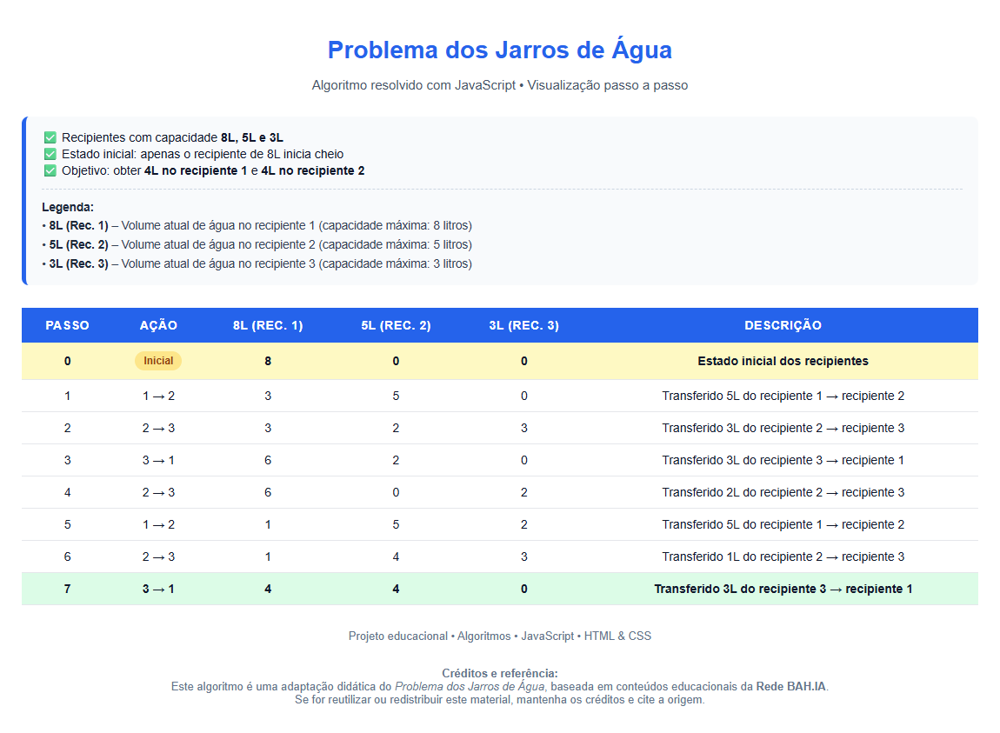

📘 Registro de aprendizado | Webinário Rede BAH.IA | 25/04/2026 – Algoritmo Jarros de Água
Como atividade prática do Webinário da Rede BAH.IA, desenvolvi a resolução do Problema dos Jarros de Água, um exemplo clássico de algoritmo baseado em estados e transições.
O exercício evidenciou a importância de regras claras e do pensamento algorítmico na organização de soluções aplicáveis também à Inteligência Artificial.
#RedeBAHIA #Algoritmos #PensamentoComputacional #InteligenciaArtificial #Tecnologia

# 💧 Problema dos Jarros de Água

Visualização didática e interativa do **Problema dos Jarros de Água**, um problema clássico da área de **algoritmos, lógica de programação e ciência da computação**.

Este projeto apresenta uma solução **passo a passo**, implementada com **HTML, CSS e JavaScript puro**, com foco educacional e clareza visual.

---

## 📘 Sobre o problema

O **Problema dos Jarros de Água** consiste em realizar transferências de água entre recipientes com capacidades conhecidas, **sem marcações de medição**, até atingir um estado final específico.

### Recipientes

- **Recipiente 1:** capacidade de 8 litros  
- **Recipiente 2:** capacidade de 5 litros  
- **Recipiente 3:** capacidade de 3 litros  

---

## ▶️ Estado inicial

- O recipiente de **8 litros inicia cheio**
- Os recipientes de **5 litros** e **3 litros iniciam vazios**

---

## 🎯 Objetivo

Obter exatamente:

- **4 litros no recipiente 1 (8L)**
- **4 litros no recipiente 2 (5L)**

---

## 📏 Regras do problema

- A água só pode ser transferida de um recipiente para outro  
- Cada transferência ocorre até que:
  - o recipiente de destino fique cheio, ou  
  - o recipiente de origem fique vazio  
- Não é permitido medir volumes intermediários  

---

## 🧠 Abordagem da solução

A solução utiliza o conceito de **busca em espaço de estados**, explorando todas as transferências possíveis entre os recipientes até que o estado desejado seja alcançado.

Cada etapa da solução é apresentada em uma **tabela visual**, exibindo:

- O passo da execução  
- A ação realizada (origem → destino)  
- O volume atual de água em cada recipiente  
- A quantidade transferida em cada passo  

Essa abordagem facilita a compreensão do algoritmo, especialmente em **contextos educacionais**.

---

## 🛠️ Tecnologias utilizadas

- **HTML5** – estrutura da aplicação  
- **CSS3** – estilização e layout  
- **JavaScript (puro)** – lógica do algoritmo e controle dos passos  

> Não são utilizados frameworks ou bibliotecas externas.

---

## 🎓 Finalidade do projeto

- Apoio ao ensino de **algoritmos e lógica**  
- Material didático para:
  - ensino fundamental  
  - ensino médio  
- Demonstração visual de um problema clássico da computação  
- Projeto educacional e de portfólio  

---

## 📄 Créditos e referência

Este projeto é uma **adaptação didática do Problema dos Jarros de Água**, baseada em conteúdos educacionais da **Rede BAH.IA**.

Se for reutilizar ou redistribuir este material, **mantenha os créditos e cite a origem (Rede BAH.IA)**.

---

## 🚀 Como executar

1. Baixe ou clone este repositório  
2. Abra o arquivo `index.html` em qualquer navegador moderno  
3. Acompanhe a execução passo a passo diretamente na tela  

---

## 📬 Observações finais

Este projeto foi desenvolvido com foco em **clareza, simplicidade e valor educacional**, sendo adequado tanto para uso em sala de aula quanto como demonstração de raciocínio algorítmico em portfólios.

``